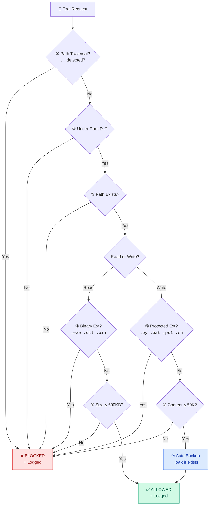

```mermaid
flowchart TD
    REQ["🔧 Tool Request"] --> R1{"① Path Traversal?<br/><code>..</code> detected?"}
    R1 -->|"Yes"| BLOCK["❌ BLOCKED<br/>+ Logged"]
    R1 -->|"No"| R2{"② Under Root Dir?"}
    R2 -->|"No"| BLOCK
    R2 -->|"Yes"| R3{"③ Path Exists?"}
    R3 -->|"No"| BLOCK
    R3 -->|"Yes"| MODE{"Read or Write?"}
    
    MODE -->|"Read"| R4{"④ Binary Ext?<br/><code>.exe .dll .bin</code>"}
    R4 -->|"Yes"| BLOCK
    R4 -->|"No"| R5{"⑤ Size ≤ 500KB?"}
    R5 -->|"No"| BLOCK
    R5 -->|"Yes"| ALLOW["✅ ALLOWED<br/>+ Logged"]

    MODE -->|"Write"| R9{"⑨ Protected Ext?<br/><code>.py .bat .ps1 .sh</code>"}
    R9 -->|"Yes"| BLOCK
    R9 -->|"No"| R8{"⑧ Content ≤ 50K?"}
    R8 -->|"No"| BLOCK
    R8 -->|"Yes"| R7["⑦ Auto Backup<br/><code>.bak</code> if exists"]
    R7 --> ALLOW

    style BLOCK fill:#fee2e2,stroke:#dc2626,color:#991b1b
    style ALLOW fill:#d1fae5,stroke:#059669,color:#065f46
    style R7 fill:#dbeafe,stroke:#2563eb,color:#1e40af
```
