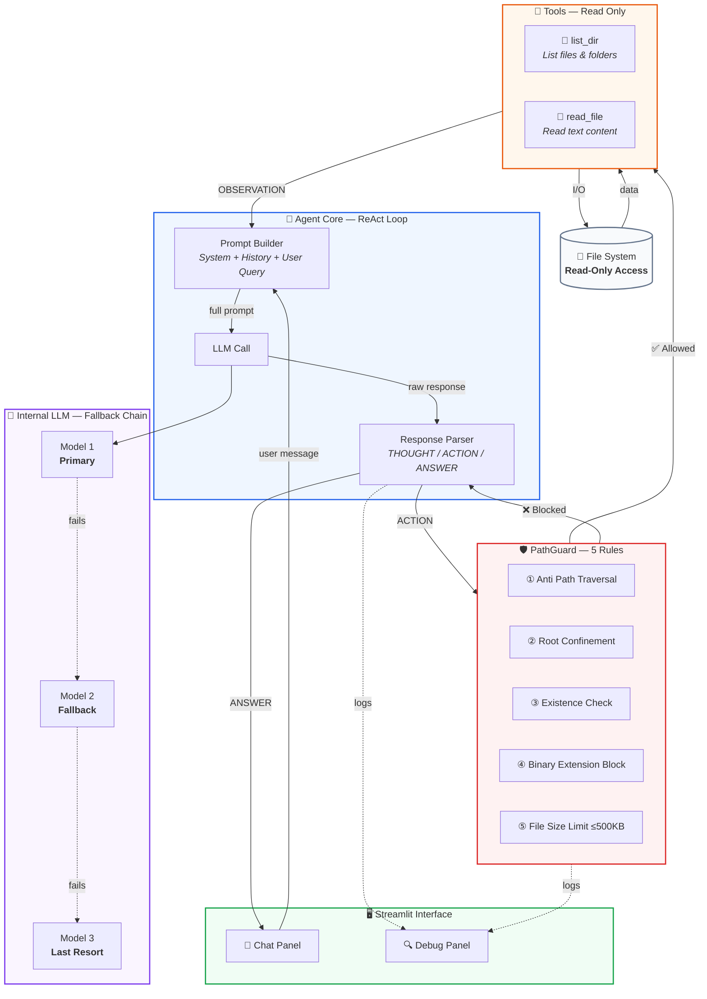

```mermaid
flowchart TB
    subgraph UI["🖥️ Streamlit Interface"]
        CHAT["💬 Chat Panel"]
        DEBUG["🔍 Debug Panel"]
    end

    subgraph AGENT["🧠 Agent Core — ReAct Loop"]
        direction TB
        PROMPT["Prompt Builder<br/><i>System + History + User Query</i>"]
        PARSE["Response Parser<br/><i>THOUGHT / ACTION / ANSWER</i>"]
        PROMPT -->|"full prompt"| LLM
        LLM -->|"raw response"| PARSE
    end

    subgraph LLM_STACK["🤖 Internal LLM — Fallback Chain"]
        direction LR
        M1["Model 1<br/><b>Primary</b>"]
        M2["Model 2<br/><b>Fallback</b>"]
        M3["Model 3<br/><b>Last Resort</b>"]
        M1 -.->|"fails"| M2
        M2 -.->|"fails"| M3
    end
    LLM["LLM Call"] --> M1

    subgraph SECURITY["🛡️ PathGuard — 5 Rules"]
        R1["① Anti Path Traversal"]
        R2["② Root Confinement"]
        R3["③ Existence Check"]
        R4["④ Binary Extension Block"]
        R5["⑤ File Size Limit ≤500KB"]
    end

    subgraph TOOLS["🔧 Tools — Read Only"]
        T1["📂 list_dir<br/><i>List files & folders</i>"]
        T2["📄 read_file<br/><i>Read text content</i>"]
    end

    FS[("💾 File System<br/><b>Read-Only Access</b>")]

    CHAT -->|"user message"| PROMPT
    PARSE -->|"ANSWER"| CHAT
    PARSE -->|"ACTION"| SECURITY
    SECURITY -->|"✅ Allowed"| TOOLS
    SECURITY -->|"❌ Blocked"| PARSE
    TOOLS -->|"I/O"| FS
    FS -->|"data"| TOOLS
    TOOLS -->|"OBSERVATION"| PROMPT

    SECURITY -.->|"logs"| DEBUG
    PARSE -.->|"logs"| DEBUG

    style UI fill:#f0fdf4,stroke:#16a34a,stroke-width:2px
    style AGENT fill:#eff6ff,stroke:#2563eb,stroke-width:2px
    style LLM_STACK fill:#faf5ff,stroke:#7c3aed,stroke-width:2px
    style SECURITY fill:#fef2f2,stroke:#dc2626,stroke-width:2px
    style TOOLS fill:#fff7ed,stroke:#ea580c,stroke-width:2px
    style FS fill:#f8fafc,stroke:#64748b,stroke-width:2px
```
