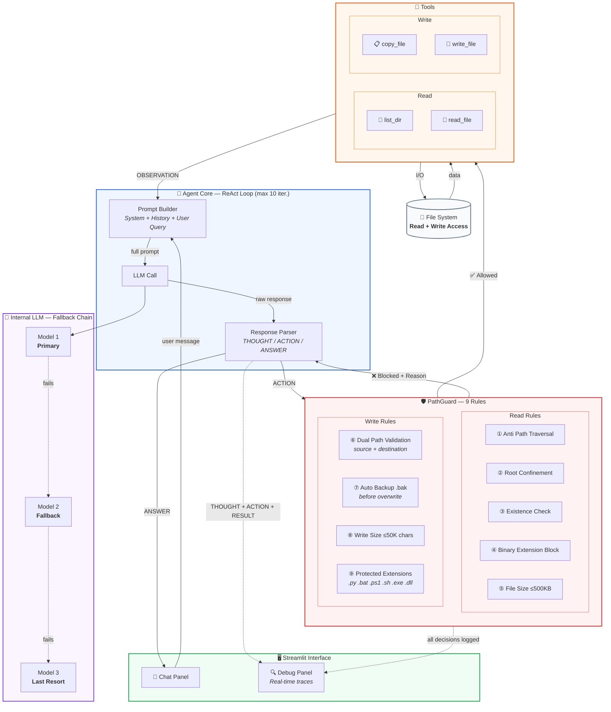

```mermaid
flowchart TB
    subgraph UI["🖥️ Streamlit Interface"]
        CHAT["💬 Chat Panel"]
        DEBUG["🔍 Debug Panel<br/><i>Real-time traces</i>"]
    end

    subgraph AGENT["🧠 Agent Core — ReAct Loop (max 10 iter.)"]
        direction TB
        PROMPT["Prompt Builder<br/><i>System + History + User Query</i>"]
        PARSE["Response Parser<br/><i>THOUGHT / ACTION / ANSWER</i>"]
        PROMPT -->|"full prompt"| LLM
        LLM -->|"raw response"| PARSE
    end

    subgraph LLM_STACK["🤖 Internal LLM — Fallback Chain"]
        direction LR
        M1["Model 1<br/><b>Primary</b>"]
        M2["Model 2<br/><b>Fallback</b>"]
        M3["Model 3<br/><b>Last Resort</b>"]
        M1 -.->|"fails"| M2
        M2 -.->|"fails"| M3
    end
    LLM["LLM Call"] --> M1

    subgraph SECURITY["🛡️ PathGuard — 9 Rules"]
        direction TB
        subgraph READ_RULES["Read Rules"]
            R1["① Anti Path Traversal"]
            R2["② Root Confinement"]
            R3["③ Existence Check"]
            R4["④ Binary Extension Block"]
            R5["⑤ File Size ≤500KB"]
        end
        subgraph WRITE_RULES["Write Rules"]
            R6["⑥ Dual Path Validation<br/><i>source + destination</i>"]
            R7["⑦ Auto Backup .bak<br/><i>before overwrite</i>"]
            R8["⑧ Write Size ≤50K chars"]
            R9["⑨ Protected Extensions<br/><i>.py .bat .ps1 .sh .exe .dll</i>"]
        end
    end

    subgraph TOOLS["🔧 Tools"]
        subgraph READ_TOOLS["Read"]
            T1["📂 list_dir"]
            T2["📄 read_file"]
        end
        subgraph WRITE_TOOLS["Write"]
            T3["📋 copy_file"]
            T4["📝 write_file"]
        end
    end

    FS[("💾 File System<br/><b>Read + Write Access</b>")]

    CHAT -->|"user message"| PROMPT
    PARSE -->|"ANSWER"| CHAT
    PARSE -->|"ACTION"| SECURITY
    SECURITY -->|"✅ Allowed"| TOOLS
    SECURITY -->|"❌ Blocked + Reason"| PARSE
    TOOLS -->|"I/O"| FS
    FS -->|"data"| TOOLS
    TOOLS -->|"OBSERVATION"| PROMPT

    SECURITY -.->|"all decisions logged"| DEBUG
    PARSE -.->|"THOUGHT + ACTION + RESULT"| DEBUG

    style UI fill:#f0fdf4,stroke:#16a34a,stroke-width:2px
    style AGENT fill:#eff6ff,stroke:#2563eb,stroke-width:2px
    style LLM_STACK fill:#faf5ff,stroke:#7c3aed,stroke-width:2px
    style SECURITY fill:#fef2f2,stroke:#dc2626,stroke-width:2px
    style READ_RULES fill:#fef2f2,stroke:#f87171
    style WRITE_RULES fill:#fef2f2,stroke:#f87171
    style TOOLS fill:#fff7ed,stroke:#ea580c,stroke-width:2px
    style READ_TOOLS fill:#fff7ed,stroke:#fb923c
    style WRITE_TOOLS fill:#fff7ed,stroke:#fb923c
    style FS fill:#f8fafc,stroke:#64748b,stroke-width:2px
```
