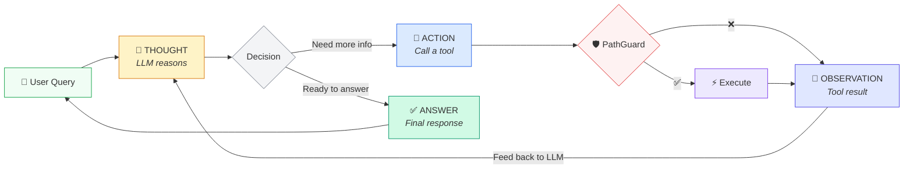

```mermaid
flowchart LR
    USER["👤 User Query"] --> THOUGHT["🧠 THOUGHT<br/><i>LLM reasons</i>"]
    THOUGHT --> DECISION{Decision}
    DECISION -->|"Need more info"| ACTION["🔧 ACTION<br/><i>Call a tool</i>"]
    ACTION --> GUARD{"🛡️ PathGuard"}
    GUARD -->|"✅"| EXEC["⚡ Execute"]
    GUARD -->|"❌"| OBS
    EXEC --> OBS["📄 OBSERVATION<br/><i>Tool result</i>"]
    OBS -->|"Feed back to LLM"| THOUGHT
    DECISION -->|"Ready to answer"| ANSWER["✅ ANSWER<br/><i>Final response</i>"]
    ANSWER --> USER

    style USER fill:#f0fdf4,stroke:#16a34a
    style THOUGHT fill:#fef3c7,stroke:#d97706
    style ACTION fill:#dbeafe,stroke:#2563eb
    style GUARD fill:#fef2f2,stroke:#dc2626
    style EXEC fill:#ede9fe,stroke:#7c3aed
    style OBS fill:#e0e7ff,stroke:#4f46e5
    style ANSWER fill:#d1fae5,stroke:#059669
    style DECISION fill:#f3f4f6,stroke:#6b7280
```
